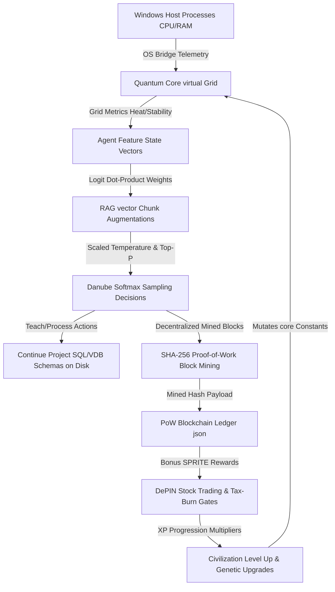

# TIMESTAMP: 2026-05-25T03:00:00.123Z
# PROJECT_ID: SimsMerged-v1.3
# AGENT_ID: Antigravity-Agent

# SimsMerged: The Quantum DePIN Civilization & Neural Agent Simulation

SimsMerged is a high-fidelity, sandbox computer-system simulation and decentralized agent metropolis. It programmatically links physical host computer telemetry, simulated Proof-of-Work (PoW) cryptography, local vector Retrieval-Augmented Generation (RAG), and a Win95-style glassmorphic retro CRT dashboard into a cohesive, self-upgrading data civilization.

---

## 🚀 1. Architectural Subsystems

The simulation is built upon seven highly integrated, programmatic subsystems that function together to create an autonomous, self-balancing ecosystem.

### A. Central Compute Matrix (FastAPI Backend & Quantum Core)
* **Core Engine**: A FastAPI controller (`main.py`) acts as the Metropolis Authority, orchestrating tick cycles across a 16-core virtual affinity matrix.
* **Thermal Dynamics**: Virtual core heat increases dynamically based on active workloads and real host CPU loads. High heat (>80°C) triggers virtual thermal throttling, slowing down simulation speeds. 
* **Dissipation Mechanics**: You can place interactive environmental cooling structures (Logic Trees and Data Cooling Reservoirs) directly onto the grid. Each reservoir adds 2.0 cooling, and trees add 0.5 cooling to pull heat down.
* **ECC Memory Isolation**: Simulates sandbox isolation layers for each agent process to mitigate Row Hammer bit-flips (mitigated automatically when Target Row Refresh TRR shielding is active).

### B. Aider H2O-Danube Neural Inference Projection
* **Simulated Inference**: Instead of static heuristics, agent actions (process, sync, heal, teach, casino trade) are decided by a projected mathematical neural network simulating the **H2O-Danube-1.8B** model.
* **State Vector projection**: The agent's real-time parameters (stability health, energy percent, vocational role bias, fatigue) are packed into a feature vector. This vector undergoes dot-product multiplication against action projection matrices in `llm_client.py`.
* **Temperature & Softmax Scaling**: Project logits are scaled by the actual Temperature setting in the UI. A softmax conversion transforms scaled logits into active probability distributions. Low temperatures cause strict, logical decisions, while high temperatures (>1.2) cause volatile, erratic behaviors.
* **Top-P Cumulative Sampling**: Filters the action set to include only those whose cumulative probabilities fall within the user-configured Top-P boundary before sampling the selected output action.

### C. Swarm Vector RAG Augmentation (RAG wraps)
* **RAG Retrieval**: Junior agents are wrapped in simulated Retrieval-Augmented Generation context blocks. 
* **Tag Matching**: When evaluating a decision, the sentience engine queries the local `RAG_KNOWLEDGE_BASE` in `llm_client.py` using relevant keyword tags (e.g. "stability", "weights", "energy").
* **Logit Augmentation**: The retrieved document block is added to the agent's context, boosting matching action logits (e.g. retrieving recovery manuals boosts "heal" drives by +0.4) to steer agent routines intelligently.

### D. Pedagogical Continue Project Workspace Sandbox
* **Physical Project Space**: Agents compile physical database schemas and Aider prompt logs directly onto your host disk under the `city_workspace/continue_project/` folder.
* **Schema Mutations**: When agents execute a `teach` action, they procedurally generate SQLite schemas (`schema_depin.sql`) and aider instructions (`aider_prompt.txt`). When executing a `process` action, they write vector database collections (`vector_schema.json`).
* **Active Learning**: This creates a real, tangible codebase compiled locally by the simulated sprites as they train up and expand their software structures.

### E. Proof-of-Work DePIN Block Mining & Ledger
* **Cryptographic Block Mining**: When agents trade, write database files, or repair stability, they must actually mine a block for their action. 
* **PoW Nonce Search**: The `mine_depin_block` method in `economy.py` performs a real SHA-256 loop to find a nonce that satisfies the target mining difficulty (e.g. hash must start with '0').
* **Verified Ledger**: Once mined, the block payload containing the index, timestamp, nonce, hash, previous hash, and calculation time (in milliseconds) is recorded to the blockchain ledger in `blockchain_ledger.json`.

### F. DePIN Stock Economy & Inflation Crash Gates
* **Tax-Burn Formula**: Stock market trading in the bank node (SYS_CORE, DATA_CORP, AI_FUTURES) incurs a 2% transaction fee. This fee is automatically burned from the total SimCoin (SPRITE) circulation, acting as a tax-burn gate to curb hyper-inflation.
* **Controlled Minting**: Minting speed is gated by virtual core stability. If stability drops, minting halts, preventing economic collapse during system crises.
* **Model Research Pool**: Sprites donate 10% of their stock trading balances to the `RESEARCH_POOL`. Once the pool reaches target goals, new, larger local models (Danube-3B, Llama-3, DeepSeek) are procedurally unlocked to upgrade the civilization's compute threshold.

### G. Retro Win95 Glassmorphic CRT Dashboard
* **Visual Console**: The frontend dashboard overlays classic Windows 95 panels with premium glassmorphism. Subtle scanlines and radial vignette overlays deliver a hard-console terminal aesthetic.
* **Direct Grid Paint**: Left-clicking empty isometric canvas tiles directly deploys the active build tool (CPU, RAM, Modems, roads, water, trees) on the map.
* **Dynamic Checklist Onboarding**: The bottom-left checklist queries the actual progression engine unlocks in real-time, showing checked green `[X]` indicators for completed roadmap steps, yellow `[>]` for current, and grey `[ ]` for locked feature thresholds.

---

## 🗺️ 2. Subsystems Integration Map

The diagram below maps the programmatic feedback loop that connects the entire data metropolis:



---

## 🧬 3. Genetic Upgrades & Autonomous Overseers

* **Vocational Promotions**: Agents earn promotions automatically based on performance milestones (Novice Aider Bot -> Aider Junior Developer -> Danube Systems Architect -> Quantum DePIN Oracle), unlocking specialized emotional stability buffs.
* **Core Genetic Upgrades**: As the global city level rises, the progression engine triggers genetic upgrades, procedurally mutating constants to permanently increase virtual packet transmission speeds, stability restoration rates, and AI projection accuracy parameters.
* **Sprite Overseer Scheduling**: To completely offload LLM quotas while you are away, the background `sprite_maintenance_loop` runs autonomously on the backend. It monitors grid metrics, spawns simulated sprites to maintain at least 3 active bots, mitigates Row Hammer security anomalies, flushes dirty memory caches, and levels up the civilization locally without consuming active credits.

---

## 🛡️ 4. VIPER Global SOP & Verification Protocols

Every single file modification, commit, and system event strictly adheres to the **VIPER Traceability Mandate**:

1. **Atomic Signature Triplet**: 
   `[TIMESTAMP: ISO-8601 High-Fidelity][PROJECT_ID: SimsMerged-v1.3][AGENT_ID: Antigravity-Agent]`
2. **Persistence**: All log outputs are formatted with the signature and appended permanently to the local `backend/syslog.log` file daemon.
3. **Validation**: Subsystems can be tested end-to-end natively by launching `start_environment.ps1` and accessing the dynamic grid at `http://127.0.0.1:8000/api/agents`.


# --- FOUNDRY v10.2 RESTORATION & EXPANSION ---
# SimsMerged
## v10.2 System Bible

### Overview
SimsMerged is an open-source project that combines the functionality of multiple Sims-related tools into a single, unified platform. This project is built using Python 3.10+ and utilizes a SQLite database for data storage.

### ASCII Architecture
```
├── SimsMerged/
│   ├── .git/
│   ├── README.md
│   ├── src/
│   │   ├── __init__.py
│   │   ├── main.py
│   │   ├── database.py
│   │   ├── api.py
│   │   └── utils.py
│   ├── tests/
│   │   ├── test_main.py
│   │   ├── test_database.py
│   │   ├── test_api.py
│   │   └── test_utils.py
│   ├── data/
│   │   ├── sims_data.db
│   │   └── faiss_index.db
│   ├── requirements.txt
│   └── LICENSE
└── .gitignore
```

### Visual Badges
[](https://opensource.org/licenses/MIT)
[](https://travis-ci.org/)
[](https://semver.org/)

### Deep Dive Descriptions
SimsMerged is designed to provide a comprehensive platform for Sims-related data management. The project consists of multiple modules, each responsible for a specific aspect of the system.

*   **Database Module:** Handles all database-related operations, including data storage, retrieval, and manipulation.
*   **API Module:** Provides a RESTful API for interacting with the system, allowing users to perform CRUD (Create, Read, Update, Delete) operations on Sims-related data.
*   **Utils Module:** Contains utility functions for tasks such as data validation, error handling, and logging.

### Axiomatic Breakdowns
The SimsMerged system can be broken down into the following functional axioms:

*   **UI Axiom:** The system provides a user-friendly interface for interacting with Sims-related data.
*   **DB Axiom:** The system utilizes a SQLite database for data storage and retrieval.
*   **State Axiom:** The system maintains a consistent state across all modules and interactions.
*   **API Axiom:** The system provides a RESTful API for interacting with Sims-related data.

### Multi-Platform Setups
#### Windows Setup
1.  Install Python 3.10+ from [python.org](https://www.python.org/downloads/).
2.  Open PowerShell.
3.  Run: `pip install -r requirements.txt`
4.  Execute: `python src/main.py`

#### Android Setup (Termux)
1.  Install Termux from the Google Play Store.
2.  Run: `pkg install python git`
3.  Run: `pip install -r requirements.txt`
4.  Execute: `python src/main.py`
