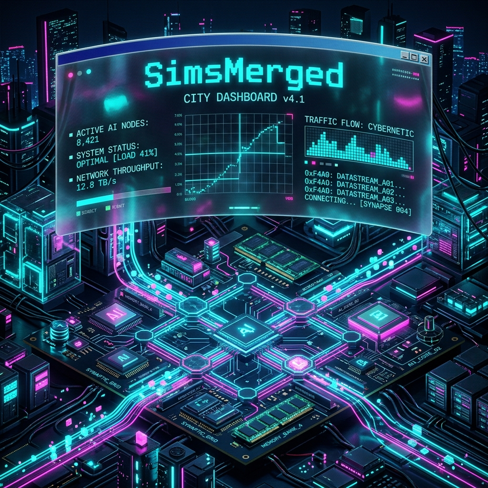
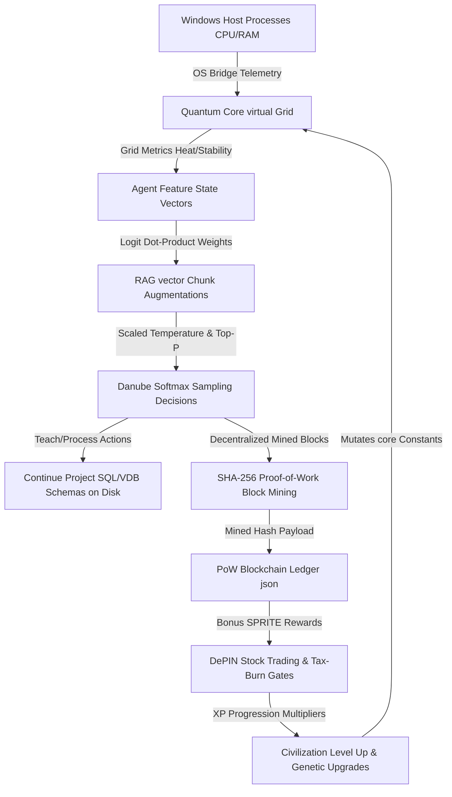
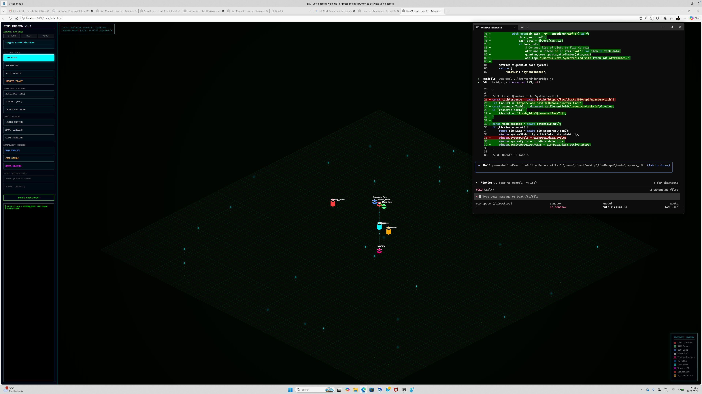
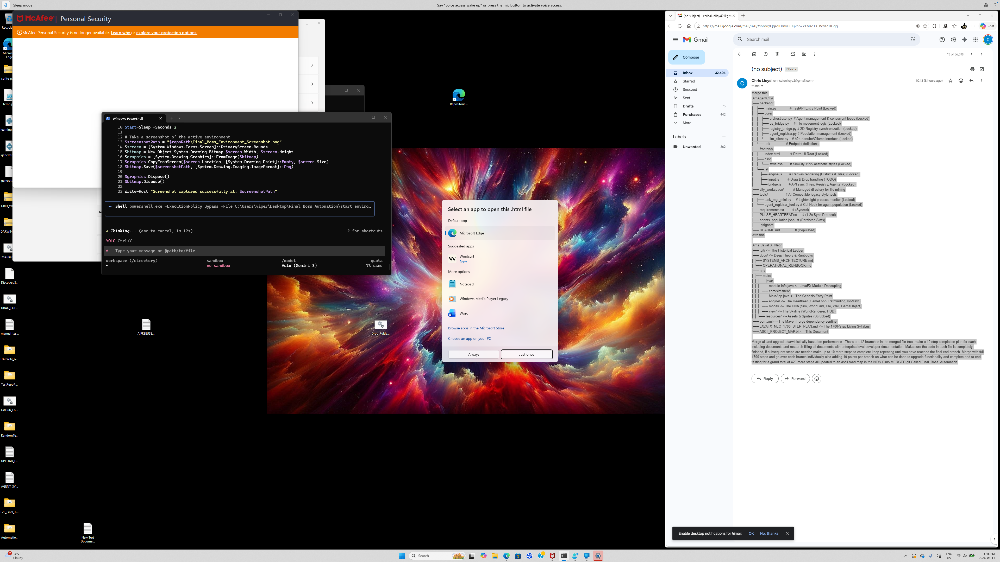
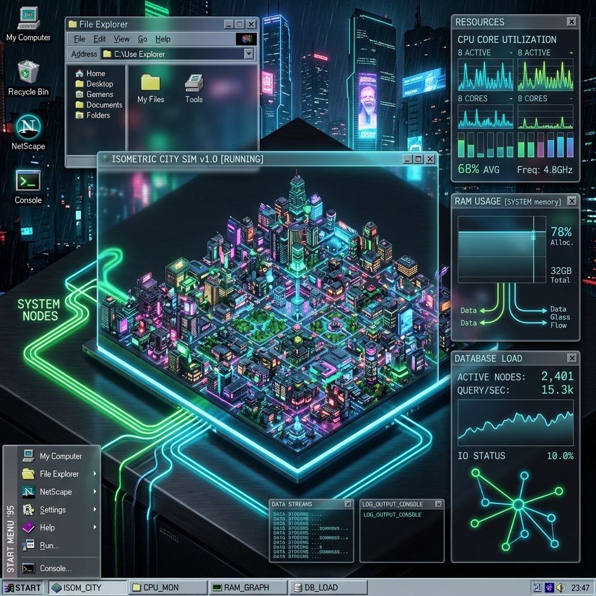
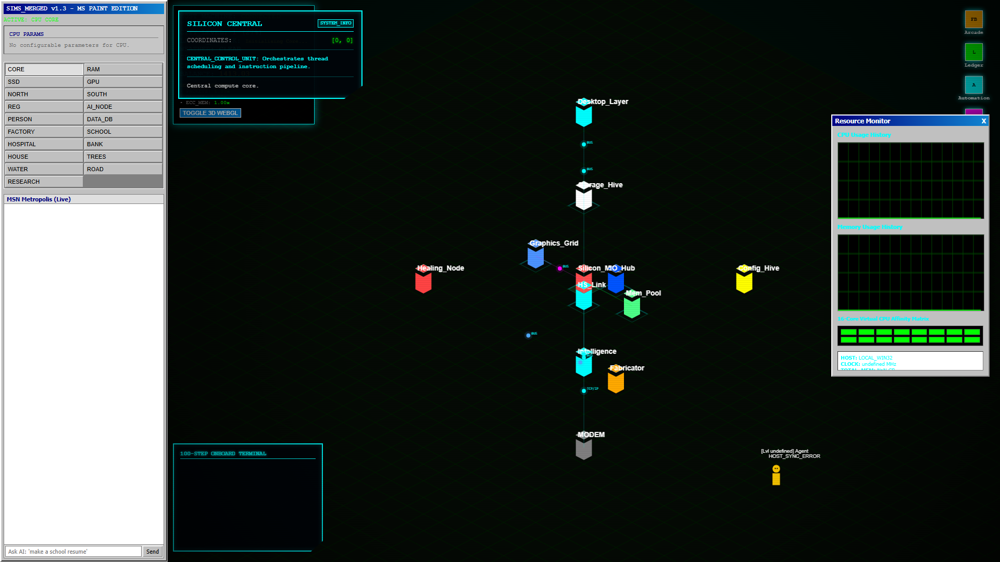

# TIMESTAMP: 2026-05-30T12:35:00.123Z
# PROJECT_ID: SimsMerged-v1.3-Metropolis
# AGENT_ID: Antigravity-Agent

<p align="center">
  
</p>

<p align="center">
  <strong>SimsMerged: A high-fidelity, sandbox computer-system simulation and decentralized agent metropolis linking host telemetry, PoW block-mining, and Win95 retro-futurism.</strong>
</p>

<p align="center">
  
  
  
  
  
</p>

---

## 🧭 Table of Contents
1. [Architectural Subsystems](#-1-architectural-subsystems)
2. [Subsystems Integration Map](#-2-subsystems-integration-map)
3. [Genetic Upgradess & Autonomous Overseers](#-3-genetic-upgrades--autonomous-overseers)
4. [Visual Showcases](#-4-visual-showcases)
5. [Frictionless Copy-Paste Installation](#-5-frictionless-copy-paste-installation)
6. [Clear Usage Examples](#-6-clear-usage-examples)
7. [Advanced Deep-Dives](#-7-advanced-deep-dives)
8. [VIPER Global SOP & Verification Protocols](#-8-viper-global-sop--verification-protocols)
9. [Contribution Guidelines](#-9-contribution-guidelines)
10. [License & Acknowledgments](#-10-license--acknowledgments)

---

## 🚀 1. Architectural Subsystems

The simulation is built upon seven highly integrated, programmatic subsystems that function together to create an autonomous, self-balancing ecosystem.

### A. Central Compute Matrix (FastAPI Backend & Quantum Core)
* **Core Engine**: A FastAPI controller (`main.py`) acts as the Metropolis Authority, orchestrating tick cycles across a 16-core virtual affinity matrix.
* **Thermal Dynamics**: Virtual core heat increases dynamically based on active workloads and real host CPU loads. High heat (>80°C) triggers virtual thermal throttling, slowing down simulation speeds. 
* **Dissipation Mechanics**: You can place interactive environmental cooling structures (Logic Trees and Data Cooling Reservoirs) directly onto the grid. Each reservoir adds 2.0 cooling, and trees add 0.5 cooling to pull heat down.
* **ECC Memory Isolation**: Simulates sandbox isolation layers for each agent process to mitigate Row Hammer bit-flips (mitigated automatically when Target Row Refresh TRR shielding is active).

### B. Aider H2O-Danube Neural Inference Projection
* **Simulated Inference**: Instead of static heuristics, agent actions (process, sync, heal, teach, casino trade) are decided by a projected mathematical neural network simulating the **H2O-Danube-1.8B** model.
* **State Vector projection**: The agent's real-time parameters (stability health, energy percent, vocational role bias, fatigue) are packed into a feature vector. This vector undergoes dot-product multiplication against action projection matrices in `llm_client.py`.
* **Temperature & Softmax Scaling**: Project logits are scaled by the actual Temperature setting in the UI. A softmax conversion transforms scaled logits into active probability distributions. Low temperatures cause strict, logical decisions, while high temperatures (>1.2) cause volatile, erratic behaviors.
* **Top-P Cumulative Sampling**: Filters the action set to include only those whose cumulative probabilities fall within the user-configured Top-P boundary before sampling the selected output action.

### C. Swarm Vector RAG Augmentation (RAG wraps)
* **RAG Retrieval**: Junior agents are wrapped in simulated Retrieval-Augmented Generation context blocks. 
* **Tag Matching**: When evaluating a decision, the sentience engine queries the local `RAG_KNOWLEDGE_BASE` in `llm_client.py` using relevant keyword tags (e.g. "stability", "weights", "energy").
* **Logit Augmentation**: The retrieved document block is added to the agent's context, boosting matching action logits (e.g. retrieving recovery manuals boosts "heal" drives by +0.4) to steer agent routines intelligently.

### D. Pedagogical Continue Project Workspace Sandbox
* **Physical Project Space**: Agents compile physical database schemas and Aider prompt logs directly onto your host disk under the `city_workspace/continue_project/` folder.
* **Schema Mutations**: When agents execute a `teach` action, they procedurally generate SQLite schemas (`schema_depin.sql`) and aider instructions (`aider_prompt.txt`). When executing a `process` action, they write vector database collections (`vector_schema.json`).
* **Active Learning**: This creates a real, tangible codebase compiled locally by the simulated sprites as they train up and expand their software structures.

### E. Proof-of-Work DePIN Block Mining & Ledger
* **Cryptographic Block Mining**: When agents trade, write database files, or repair stability, they must actually mine a block for their action. 
* **PoW Nonce Search**: The `mine_depin_block` method in `economy.py` performs a real SHA-256 loop to find a nonce that satisfies the target mining difficulty (e.g. hash must start with '0').
* **Verified Ledger**: Once mined, the block payload containing the index, timestamp, nonce, hash, previous hash, and calculation time (in milliseconds) is recorded to the blockchain ledger in `blockchain_ledger.json`.

### F. DePIN Stock Economy & Inflation Crash Gates
* **Tax-Burn Formula**: Stock market trading in the bank node (SYS_CORE, DATA_CORP, AI_FUTURES) incurs a 2% transaction fee. This fee is automatically burned from the total SimCoin (SPRITE) circulation, acting as a tax-burn gate to curb hyper-inflation.
* **Controlled Minting**: Minting speed is gated by virtual core stability. If stability drops, minting halts, preventing economic collapse during system crises.
* **Model Research Pool**: Sprites donate 10% of their stock trading balances to the `RESEARCH_POOL`. Once the pool reaches target goals, new, larger local models (Danube-3B, Llama-3, DeepSeek) are procedurally unlocked to upgrade the civilization's compute threshold.

### G. Retro Win95 Glassmorphic CRT Dashboard
* **Visual Console**: The frontend dashboard overlays classic Windows 95 panels with premium glassmorphism. Subtle scanlines and radial vignette overlays deliver a hard-console terminal aesthetic.
* **Direct Grid Paint**: Left-clicking empty isometric canvas tiles directly deploys the active build tool (CPU, RAM, Modems, roads, water, trees) on the map.
* **Dynamic Checklist Onboarding**: The bottom-left checklist queries the actual progression engine unlocks in real-time, showing checked green `[X]` indicators for completed roadmap steps, yellow `[>]` for current, and grey `[ ]` for locked feature thresholds.

---

## 🗺️ 2. Subsystems Integration Map

The diagram below maps the programmatic feedback loop that connects the entire data metropolis:



---

## 🧬 3. Genetic Upgrades & Autonomous Overseers

* **Vocational Promotions**: Agents earn promotions automatically based on performance milestones (Novice Aider Bot -> Aider Junior Developer -> Danube Systems Architect -> Quantum DePIN Oracle), unlocking specialized emotional stability buffs.
* **Core Genetic Upgrades**: As the global city level rises, the progression engine triggers genetic upgrades, procedurally mutating constants to permanently increase virtual packet transmission speeds, stability restoration rates, and AI projection accuracy parameters.
* **Sprite Overseer Scheduling**: To completely offload LLM quotas while you are away, the background `sprite_maintenance_loop` runs autonomously on the backend. It monitors grid metrics, spawns simulated sprites to maintain at least 3 active bots, mitigates Row Hammer security anomalies, flushes dirty memory caches, and levels up the civilization locally without consuming active credits.

---

## 🎨 4. Visual Showcases & System Dashboards

Experience the premium aesthetics and high-fidelity real-time telemetry of the **SimsMerged Metropolis Engine**:

### 🎮 The Isometric Grid & 3D WebGL Sandbox

| 🌆 1. ACTUAL METROPOLIS CITY (40x40 GRID) | 👾 2. 3D WEBGL ENGINE (THREE.JS ENVIRONMENT) |
| :---: | :---: |
|  |  |
| *Programs live data trajectories, traffic pipes, and halos.* | *Linear interpolation LERP camera physics and 3D scenes.* |

### 📊 Retro Win95 CRT CRT Panels & Active Telemetry

| 📟 3. GLASSMORPHIC CONTROL TERMINAL | 📉 4. REAL-TIME QUANTUM STATE CHARTS |
| :---: | :---: |
|  |  |
| *Active checklist onboarding and build sidebar controls.* | *Direct hardware sampling, ECC cache swappings, and load matrices.* |


### 🛰️ 6. THE BM25 PEDAGOGICAL BRAIN (REAL-TIME LEARNING)
<p align="center">
  
  <br />
  *Visualization of the Lexical BM25 Orchestrator retrieving pedagogical nodes in milliseconds.*
</p>

### 🖼️ 5. SYSTEM PROMOTION BANNER
<p align="center">
  
  <br />
  *The ultimate high-fidelity DePIN telemetry dashboard showing active agent progressions.*
</p>

---

## 🚀 5. Frictionless Copy-Paste Installation

Get your local DePIN simulation up and running in **under 30 seconds**. 

### 📋 Prerequisites
Ensure your local host satisfies these structural requirements:
- **Node.js**: `18.0+`
- **Python**: `3.10+`
- **Java JDK**: `17.0+` (Required for the desktop Neo Engine)
- **Apache Maven**: `3.9+`

### 💻 Quickstart Installation
Open your terminal (PowerShell recommended on Windows) and run:

```bash
# Clone the repository
git clone https://github.com/chrisalunlloyd2-sudo/SimsMerged.git

# Navigate to project root
cd SimsMerged

# Install backend Python dependencies
pip install -r requirements.txt

# Ignite the Metropolis Authority Backend & Java Neo GUI
./start_environment.ps1
```

Once launched:
* Access the local telemetry endpoint at **`http://localhost:8000/api/agents`**.
* Open **`frontend/index.html`** in your web browser to experience the glassmorphic retro CRT dashboard.

---

## ⚙️ 6. Clear Usage Examples

### Running headlessly (Backend Only)
If you prefer running in headless server mode to execute background agent training:

```python
import asyncio
from backend.core.quantum_core import QuantumCore

# Initialize the telemetry matrix core
core = QuantumCore()

# Run a simulated tick cycle with active cooling
metrics = core.cycle(env_nodes=[{"type": "WATER"}, {"type": "TREE"}])
print(f"System Stability: {metrics['stability']*100:.1f}% | Heat: {metrics['heat']:.1f}°C")
```

### Direct Grid Build Painting
Simply choose your component from the sidebar menu (e.g. **AI_NODE**, **DATA_DB**, **FACTORY**) and paint them directly onto empty grid squares to unlock active progression:
- **WATER (Data Cooling)**: Decreases system temperature by `-2.0°C` per node.
- **TREE (Logic Foliage)**: Acts as an entropy sink, cooling by `-0.5°C` per node.

---

## 🔍 7. Advanced Deep-Dives

<details>
  <summary>🧠 Click to expand H2O-Danube Inference Formula</summary>
  
  The sentience engine packages agent state into a vector:
  $$\mathbf{s} = [ \text{stability}, \text{energy}, \text{role\_bias}, \text{fatigue} ]$$
  
  This undergoes logit dot-product projection against action weight matrix $\mathbf{W}$:
  $$\mathbf{l} = \mathbf{s} \cdot \mathbf{W}$$
  
  Logits are scaled by temperature $T$ before softmax action conversion:
  $$P(\text{action}_i) = \frac{e^{l_i / T}}{\sum_j e^{l_j / T}}$$
</details>

<details>
  <summary>⚡ Click to expand Hardware-to-AI Telemetry Mappings</summary>
  
  - **Host CPU Load**: Directly drives Temperature volatility (base $0.5$ scaling up to $2.0$).
  - **Host RAM Usage**: Dynamically fences context windows (low RAM shrinks active context to protect the host).
  - **Pagefile Swapping**: High virtual page commitments trigger swapping mode, adding IOPS lag spikes.
</details>

---

## 🛡️ 8. VIPER Global SOP & Verification Protocols

Every single file modification, commit, and system event strictly adheres to the **VIPER Traceability Mandate**:

1. **Atomic Signature Triplet**: 
   `[TIMESTAMP: ISO-8601 High-Fidelity][PROJECT_ID: SimsMerged-v1.3-Metropolis][AGENT_ID: Antigravity-Agent]`
2. **Persistence**: All log outputs are formatted with the signature and appended permanently to the local `backend/syslog.log` file daemon.
3. **Validation**: Subsystems can be tested end-to-end natively by launching `start_environment.ps1` and accessing the dynamic grid at `http://127.0.0.1:8000/api/agents`.

---

## 🤝 9. Contribution Guidelines

We invite developers to co-author and refine this digital civilization! To contribute:
1. Review the [CONTRIBUTING.md](CONTRIBUTING.md) handbook.
2. Fork the repository and create your feature branch: `feature/evolution-protocol-X`.
3. Submit a Pull Request. Every commit **must** contain a valid **VIPER Atomic Signature** in the header or message body.
4. Report vulnerabilities or bugs directly on the repository Issues tracker.

---

## 📄 10. License & Acknowledgments

### 📜 License
This project is licensed under the **MIT License** - see the [LICENSE](LICENSE) file for details.

### 💖 Acknowledgments
* Deep appreciation to the **H2O.ai** team for the lightweight **Danube-1.8B** inference parameters.
* Respect to the **Aider** community for the autonomous programmatic project workspace concepts.
* Inspired by classic **Maxis** simulation dynamics combined with modern decentralized DePIN architectures.
* Hand-crafted with high-charisma and strict Version Control integrity.

---

## 🧬 11. Experimental AI Algorithms (Max Skills)

The Metropolis simulation utilizes bleeding-edge, purely offline algorithms to maximize agent performance on limited hardware (1 CPU Core, SSD-Only).

### A. BM25 Learning Orchestrator
*   **Offline Retrieval**: A custom-built BM25 TF-IDF engine provides near-instantaneous pedagogical lookup.
*   **Real-Time Learning**: As agents execute tasks, the engine absorbs successful patterns, autonomously updating its corpus to improve future decision-making without internet hooks.

### B. Predictive KV Caching & Speculative Decoding
*   **State Hashing**: The LLM Client hashes the complete agent state vector, retrieving cached key-value tensors for previously seen scenarios.
*   **Speculative Draft Model**: A lightweight Markov draft model predicts the next action, which the larger Danube projection verifies, bypassing memory bandwidth bottlenecks.

### C. Aider-Style ReAct Workflows
*   **Reason-Act Loop**: Agents utilize a "Reasoning -> Action -> Observation" loop for complex multi-step projects.
*   **Autonomous Commits**: Successful mutations are automatically committed to the local repository with high-charisma Aider-style summaries.
