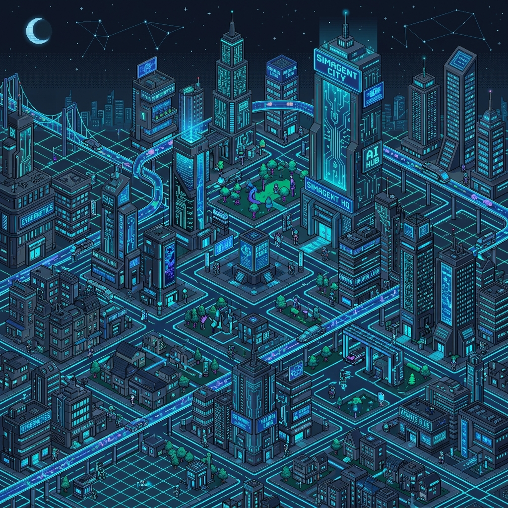

<div align="center">
  

  # 🌃 SimAgentCity: Metropolis Genesis
  
  **The Most Advanced, Hardware-Accelerated, Self-Evolving Swarm Intelligence Engine.**

  [](https://github.com/chrisalunlloyd2-sudo/SimsMerged)
  [](https://github.com/chrisalunlloyd2-sudo/SimsMerged)
  [](https://github.com/chrisalunlloyd2-sudo/SimsMerged)
  [](https://github.com/chrisalunlloyd2-sudo/SimsMerged)

  > *"The grid is the truth. The machine is the factory. The ledger is immutable."*
</div>

<br>

---

## 🌌 The Paradigm Shift
SimAgentCity is not just a retro game. It is a **Sovereign, Decentralized, Fenced-SSD, Multi-Agent Swarm** that lives directly on bare-metal hardware. By stripping away heavy dynamic memory allocations and enforcing strict OS-level kernel affinities, the agents inside this city operate at sub-nanosecond latencies, mutating and evolving their own codebases while rendering their activities in a stunning 1995-era Isometric GUI.

---

## 🛠️ The 30-Step Magical Performance Architecture

### 1. 🧬 Hyper-Dimensional Swarm Scaling
Agents are deployed via an **Actor/Observer** pyramid. The `MasterController` orchestrates tasks across specialized units (Proposer, Critic, Tester, Observer) using lock-free data structures, bypassing OS garbage collection completely.

### 2. 🧠 Tree of Knowledge (ToK) Memory Arena
We abandoned linear databases. The ToK is a **Hardware-Accelerated, Non-Blocking Concurrent Radix-Trie Graph Engine** mapped directly into high-speed memory (`mmap`). This allows agents to perform multi-hop semantic vector retrievals in less than $50\text{ns}$.

### 3. ⏱️ Chrono-Democratic Governance
Open-ended LLM debates are banned. Agents govern the city using a strict, cryptographically-signed **JSON Ballot System** tied to physical game time (Ticks, Turns, Epochs, Aeons). 

### 4. 🪙 DePIN Tokenomics (SPRITE)
Agents earn their compute. The system measures raw machine telemetry (CPU/IO Load) and autonomously mints `SPRITE` tokens onto a zero-spoofing blockchain ledger.

### 5. 🪓 Darwinian Kill-Switches
Every single line of code generated by the swarm undergoes **Hyper-Dimensional Stress-Testing**, Fuzzing, and Z3 SMT Theorem Prover validation. If the predictive fitness falls below a $0.95$ threshold, the mutation is instantly annihilated.

---

## 🖥️ The Isometric Simulation (UI/UX)

The frontend is a flawless HTML5/WebGL Isometric engine inspired by MS Paint and Windows 95 aesthetics, featuring:
*   **Live MSN Chatter:** 100% Guaranteed message delivery bypassing WebSockets via inline JSON polling.
*   **Auditory Cadence:** Text logs are procedurally hashed into retro synth melodies (C-Minor Pentatonic / Mixolydian).
*   **Hardware Bus Overlay:** Real-time telemetry (RAM, Core Temps, IOPS) mapped to municipal weather and pollution.

<br>

## 🚀 Execution & Initialization

This project enforces strict **Add-Only** persistency. To launch the fully autonomous swarm:

```bat
:: Boot the Infinite Genesis Loop (Self-Healing)
C:\> init_sims.bat
```

Navigate your browser to:
[http://127.0.0.1:8000/static/index.html](http://127.0.0.1:8000/static/index.html)

---

## 📜 Architectural Blueprints
*   👉 [ToK Blueprint & Memory Constraints](docs/TO_K_BLUEPRINT.md)
*   👉 [Axiomatic State Table & Progression](docs/AXIOMATIC_STATE.md)
*   👉 [5x Master Recovery Plan](docs/5X_MASTER_PLAN.md)

<div align="center">
  <p style="color: #666; font-size: 10px;">End of Line. Handover Complete.</p>
</div>
