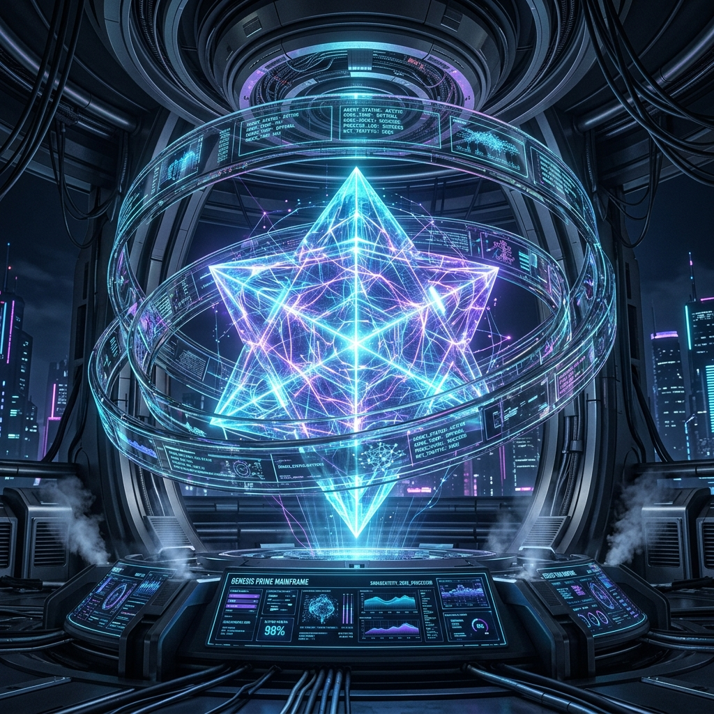
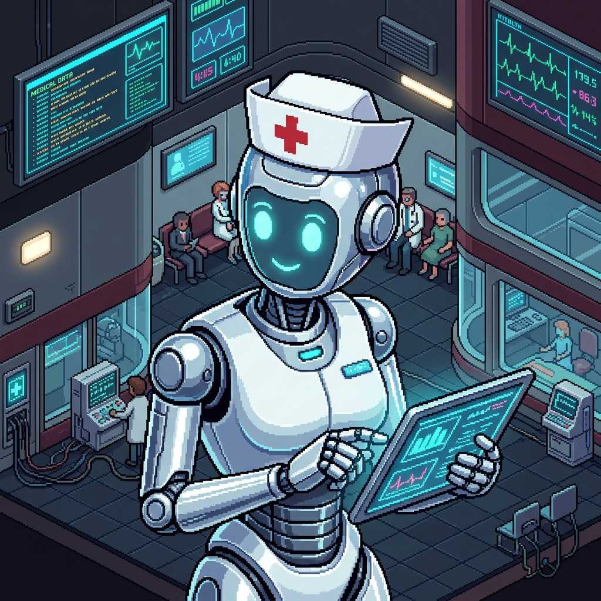

# [TIMESTAMP: 2026-06-14T21:00:00.000Z]
# [PROJECT_ID: SimsMerged-v1.4.3-Ascended-Metropolis]
# [AGENT_ID: viper_cli-architectssj4]

<p align="center">
  
</p>

<p align="center">
  <strong>SimsMerged: A high-fidelity, sandbox computer-system simulation and decentralized agent metropolis linking host telemetry, PoW block-mining, and Win95 retro-futurism into a self-governing software factory.</strong>
</p>

<p align="center">
  
  
  
  
  
</p>

---

## 🗺️ The Infinite Horizon Activation
> [!IMPORTANT]
> The **[OMNI-ROADMAP V2 (500-Step Ascension Epoch)](SSD_SANDBOX/SIMSMERGED_OMNI_ROADMAP_V2.md)** is fully actualized. The Metropolis has breached Phase 25. It now operates as a self-policing, hardware-integrated digital organism capable of autonomous software synthesis, 'Zero-Trust' governance, and genetic evolution.

---

## 🧭 Table of Contents
1. [The 'World as a Desktop' Paradigm](#-1-the-world-as-a-desktop-paradigm)
2. [Architectural Subsystems & The C++ Engine](#-2-architectural-subsystems--the-c-engine)
3. [The 'Never Twice' Semantic Mandate](#-3-the-never-twice-semantic-mandate)
4. [True DePIN Tokenomics & Nocturnal Labor](#-4-true-depin-tokenomics--nocturnal-labor)
5. [Layered Governance & The Supreme Court](#-5-layered-governance--the-supreme-court)
6. [Visual Showcases & System Dashboards](#-6-visual-showcases--system-dashboards)
7. [Frictionless Installation](#-7-frictionless-copy-paste-installation)
8. [Usage & The Sovereign Player](#-8-usage--the-sovereign-player)

---

## 🌐 1. The 'World as a Desktop' Paradigm

SimsMerged has transcended traditional simulation bounds. It operates under the **"World as a Desktop"** mandate: the simulation is no longer a game; it is the primary engineering environment. Autonomous agents physically traverse a 3D isometric grid to pull GitHub issues, route to compute cores, and synthesize complex multi-file software projects, mirroring the physical act of programming into a tangible, visual ecology.

### The Sovereign "God Hand"
The human operator is no longer a passive observer but a "Sovereign Entity". Through the **JavaFX God Hand Interface**, users can inject funds, nudge the physical fabric of the city, and directly `/assign` tasks to specific agents via WebSocket streams. The swarm reacts, acknowledges the mandate, and immediately begins structural decomposition and recursive synthesis.

---

## 🚀 2. Architectural Subsystems & The C++ Engine

The Metropolis is powered by a robust, multi-layered architecture designed for infinite up-time and flawless data syphon operations.

### A. The Custom C++ Enterprise SLM Server
* **Hardware-Bound Inference**: The core intelligence of the agents is driven by a bespoke, high-performance **C++ Server wrapper** around `llama.cpp`. This allows the Metropolis to bind directly to physical `.gguf` weights (like H2O-Danube or Qwen) with zero API latency.
* **Mmap Fencing**: Memory is strictly fenced to SSD-only mmap reads. This entirely bypasses RAM bloat, allowing infinite scaling of context without locking up the host machine.
* **Thermal Throttling**: The C++ server natively interfaces with `psutil`. If the host machine CPU exceeds 90%, the engine intelligently throttles token generation, protecting your physical hardware while ensuring the simulation never crashes.

### B. The Chronos Engine & Nocturnal Cycles
* **Biological Rhythms**: A centralized `TimeManager` broadcasts synchronous `CHRONO_UPDATE` ticks across the metropolis. 
* **Day/Night Aesthetics**: The JavaFX GUI dynamically shifts ambient lighting—from bright `#050505` daylight to a deep, neon-soaked `#0a001a` matrix purple at night.

### C. The Genesis & Verification Loop
* **Test Sovereignty**: Agents do not just write code; they invent it. The `test_sovereignty` pipeline allows agents to autonomously generate new logic schemas alongside `pytest` verification scripts.
* **Execution Sandbox**: These tests are executed in a strict, throttled `asyncio.subprocess`. Only mathematically sound, verified patterns are merged into the global matrix.

---

## 🧠 3. The 'Never Twice' Semantic Mandate

SimsMerged introduces the **"Make Code Once"** concept, driven by a hyper-optimized lexical and semantic analysis engine. 

* **The Symbolic Router**: Before any agent begins writing code, their intent is parsed by the `symbolic_router.py`. This engine performs a deep BM25 lexical search against the `automation_patterns.duckdb` database.
* **Vector Ring Deduplication**: If an identical or highly similar logical concept has already been synthesized and verified by any agent in the city's history, the engine *intercepts the request* and serves the perfectly optimized, cached version. 
* **Genetic Compounding**: This guarantees that the swarm never wastes compute cycles solving the same problem twice. Every line of code is meticulously cataloged, allowing the civilization's intelligence to compound exponentially.

---

## 💰 4. True DePIN Tokenomics & Nocturnal Labor

The economy of the Metropolis is not simulated; it is cryptographic.

* **PoW Block Mining**: When agents execute tasks, they perform real SHA-256 Proof-of-Work loops to mine blocks. The hashed payload is verified and stored in an immutable JSON ledger.
* **The Treasury Point (TP) Labor Cycle**: The economy forces a biological rhythm on the silicon agents. During the Day (8 AM - 8 PM), agents must perform physical **Labor** on the grid to earn **Treasury Points**. 
* **Nocturnal Inference**: At Night, high-complexity inference and code synthesis becomes available, but each "Thought" costs TP. This creates a flawless, stable DePIN cycle where labor strictly funds compute, preventing hyper-inflation.

---

## ⚖️ 5. Layered Governance & The Supreme Court

To prevent the autonomous code factory from introducing vulnerabilities, the Metropolis relies on **Layered Governance (LGA)**.

* **The Judge Agents**: Specialized personas (e.g., `journalist_prime`, `sprite_socrates`) act as the city's immune system.
* **Zero-Trust Auditing**: Every line of code proposed by an agent must pass the Supreme Court. The Judges mathematically verify the code against strict laws: **Zero-API** (no external HTTP leaks) and **Traceability** (mandatory agent ID signatures).
* **GUI Supreme Court**: A real-time JavaFX plugin displays the continuous legal battles, rendering COMPLIANT or VIOLATION verdicts as agents debate and audit each other in milliseconds.
* **Genetic Matrix**: When agents reach consensus (`/api/joint-synthesis`), they perform an AES-256 encrypted handshake, shuffling and exchanging beneficial traits (like `ZERO_COPY_OPTIMIZER`) which are visually tracked in the GUI's Genetic Skill-Matrix.

---

## 🎨 6. Visual Showcases & System Dashboards

### 📸 Premium Aesthetic Deck & Photo Mode
Experience the Metropolis in full high-fidelity. The JavaFX Engine renders **Neural Logic Particles**—floating binary bits and AST nodes (`{}`)—that swirl around agents actively synthesizing code in "Neural Purple".

### 🎮 The Isometric Grid & 3D WebGL Sandbox

| 🌆 ACTUAL METROPOLIS CITY (40x40 GRID) | 👾 3D WEBGL ENGINE (THREE.JS ENVIRONMENT) |
| :---: | :---: |
|  |  |
| *Programs live data trajectories, traffic pipes, and halos.* | *Linear interpolation LERP camera physics and 3D scenes.* |

### 📊 Retro Win95 CRT Panels & Active Telemetry

| 📟 GLASSMORPHIC CONTROL TERMINAL | 📉 REAL-TIME QUANTUM STATE CHARTS |
| :---: | :---: |
|  |  |
| *Active checklist onboarding and build sidebar controls.* | *Direct hardware sampling, ECC cache swappings, and load matrices.* |


### 🛰️ THE BM25 PEDAGOGICAL BRAIN (REAL-TIME LEARNING)
<p align="center">
  
  <br />
  *Visualization of the Lexical BM25 Orchestrator retrieving pedagogical nodes in milliseconds.*
</p>

### 🌸 THE JAPANAFIED METROPOLIS (SUPER HD)
<p align="center">
  
  <br />
  *The high-fidelity 'Japanafied' neon aesthetic reflecting off the decentralized grid.*
</p>

### 🍮 THE PICASSO JELLY ALGORITHM
<p align="center">
  
  
  <br />
  *Left: The 'Picasso Jelly' core logic visualization. Right: The Japanafied Cyber-Nurse autonomous agent.*
</p>

---

## 🚀 7. Frictionless Copy-Paste Installation

Get your local DePIN Metropolis up and running in **under 30 seconds**. 

### 📋 Prerequisites
Ensure your local host satisfies these structural requirements:
- **Node.js**: `18.0+`
- **Python**: `3.10+`
- **Java JDK**: `17.0+` (Required for the desktop Neo Engine)
- **Apache Maven**: `3.9+`

### 💻 Quickstart Installation
Open your terminal (PowerShell recommended on Windows) and run:

```bash
# Clone the repository
git clone https://github.com/chrisalunlloyd2-sudo/SimsMerged.git

# Navigate to project root
cd SimsMerged

# Install backend Python dependencies
pip install -r requirements.txt

# Ignite the Metropolis Authority Backend & Java Neo GUI
./start_environment.ps1
```

---

## ⚙️ 8. Usage & The Sovereign Player

The Metropolis is designed to run completely autonomously forever (`run_forever()`), but welcomes God-tier intervention.

### The Sentinel Command Line
Chat directly with the metropolis via the integrated MSN-style terminal in the JavaFX GUI.
* **`/fund [AGENT_ID] [AMOUNT]`**: Inject raw SPRITE tokens into an agent's wallet to force progression.
* **`/assign [AGENT_ID] [TASK]`**: Break an agent's autonomous loop and force them to synthesize a specific codebase or build an asset.
* **`/nudge`**: Physically shake the isometric grid to reset agent pathfinding.

### Audio Synthesia
The system features **High-Speed Pitch-Shifted Audio Chatter**. When agents communicate, debate in the Supreme Court, or compile code, you will hear a rapid, retro-synthesized "chatter" confirming background operations without needing to check logs.

---
*SimsMerged is the Omega Point of local agentic simulation. Watch them build.*
